# Галерея скріншотів

Повний перелік усіх 23 скріншотів з описом, у порядку виконання проєкту.

## Розгортання Suricata

**fig-01 — Перевірка встановлення Suricata**
`suricata -V` та `pacman -Qs suricata` підтверджують встановлену версію 8.0.4 у CachyOS.
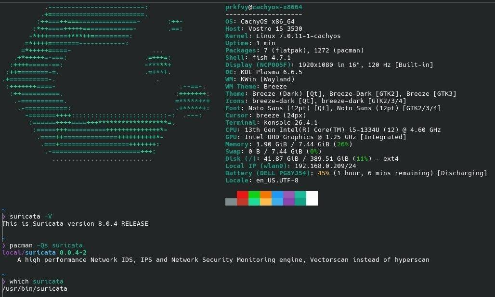

**fig-02 — Визначення мережевого інтерфейсу**
`ip a` показує активний інтерфейс `wlan0` та IP-адресу системи `192.168.0.209`.
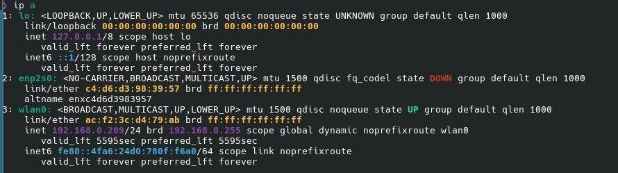

**fig-03 — Оновлення правил (`suricata-update`)**
Завантаження стандартного набору Emerging Threats (66 106 правил).
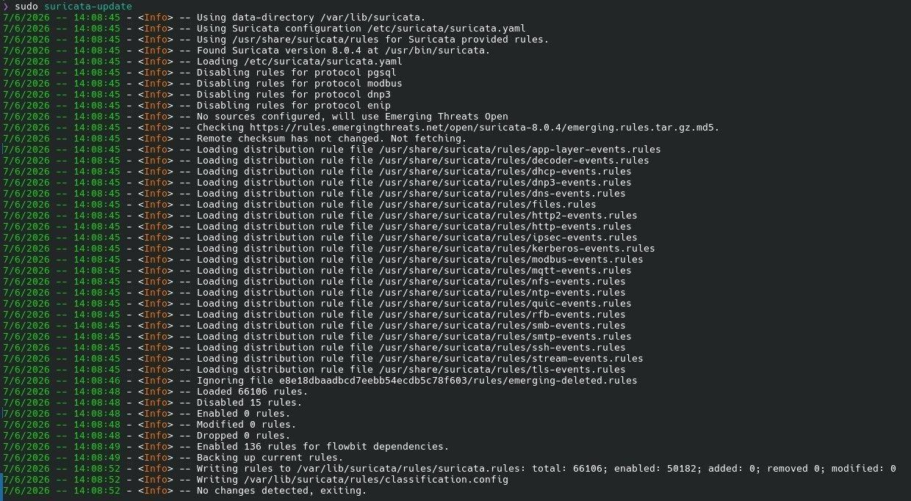

**fig-04 — Перелік файлів правил**
`ls /var/lib/suricata/rules/` — `classification.config`, `local.rules`, `suricata.rules`.
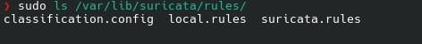

**fig-05 — Фрагмент `suricata.yaml`**
`default-rule-path` та `rule-files`, які підключають `local.rules`.
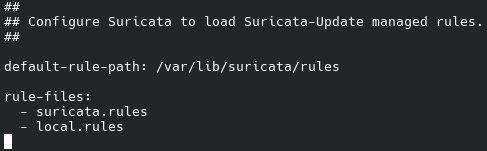

**fig-06 — Локальні тестові правила**
Вміст `local.rules` у `nano` — усі 12 сигнатур для тестових сценаріїв.
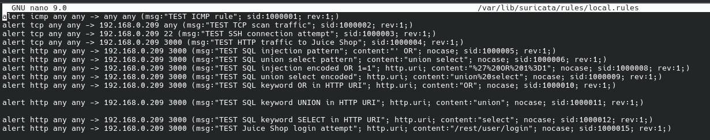

**fig-07 — Перевірка конфігурації**
`suricata -T -c suricata.yaml -v` — 0 помилкових правил, 50195 сигнатур завантажено.
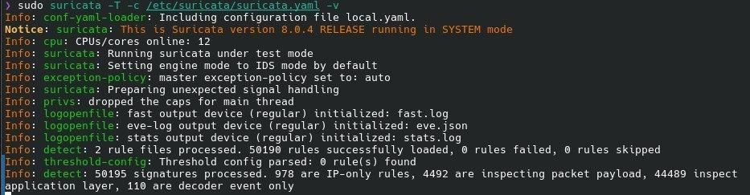

**fig-08 — Запуск Suricata на `wlan0`**
`sudo suricata -c suricata.yaml -i wlan0` — engine started.
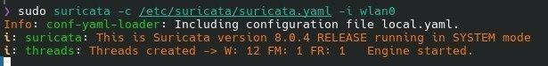

## Сценарій 1–3: мережеві тести

**fig-09 — ICMP-запит з Kali Linux**
`ping 192.168.0.209`.
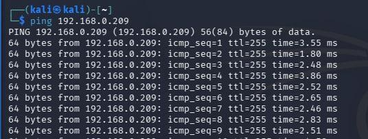

**fig-10 — Спрацювання ICMP-правила**
Запис `TEST ICMP rule` у `fast.log`.
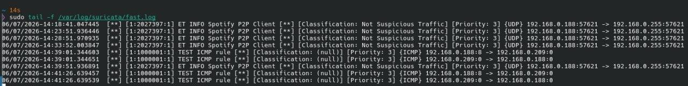

**fig-11 — Сканування портів Nmap**
`sudo nmap -sS -Pn -T4 192.168.0.209`.
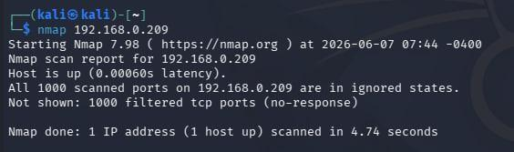

**fig-12 — Спрацювання TCP-правила під час сканування**
Серія записів `TEST TCP scan traffic` у `fast.log`.
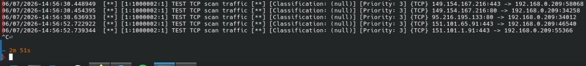

**fig-13 — Спроба SSH-підключення**
`ssh` з Kali Linux до CachyOS.
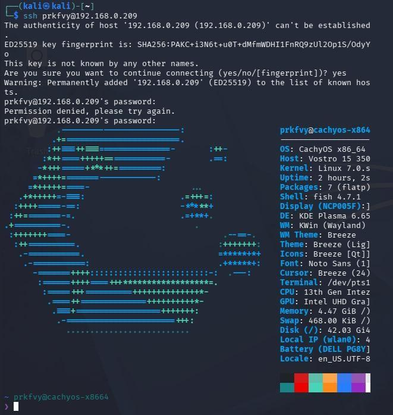

**fig-14 — Спрацювання SSH-правила**
Запис `TEST SSH connection attempt` у `fast.log`.
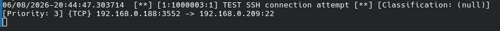

## Сценарій 4–6: вебатаки та навантаження

**fig-15 — Запуск OWASP Juice Shop у Docker**
`docker run --rm -p 3000:3000 --name juice-shop bkimminich/juice-shop`.
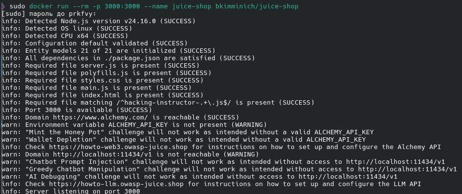

**fig-16 — OWASP Juice Shop у браузері**
Доступність вебдодатка з Kali Linux за `http://192.168.0.209:3000`.
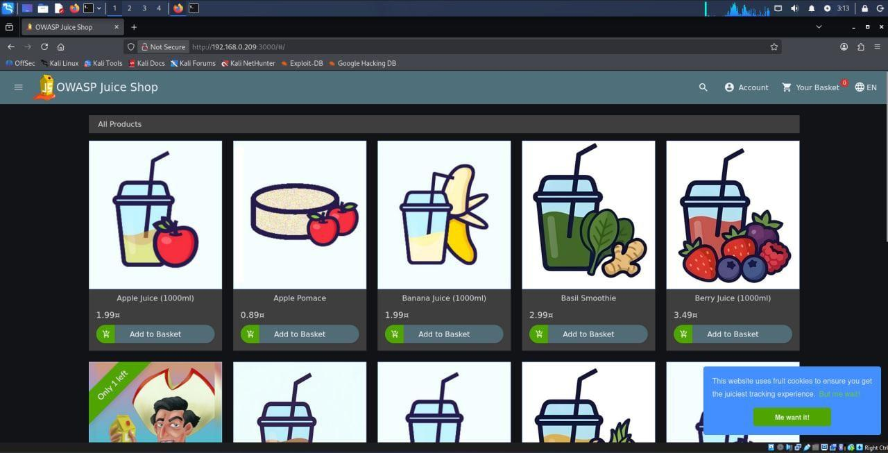

**fig-17 — SQL-injection запит**
`curl` з параметром `' OR 1=1--`.
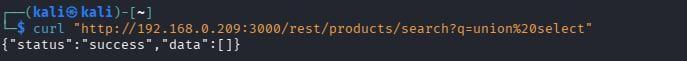

**fig-18 — SQL-запит з ключовими словами union select**
Відповідь вебдодатка з помилкою SQLite.
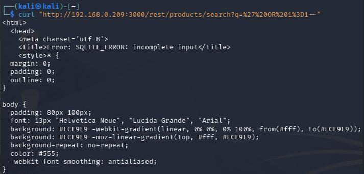

**fig-19 — Спрацювання SQL-правил**
Записи `TEST SQL keyword UNION/SELECT in HTTP URI` у `fast.log`.
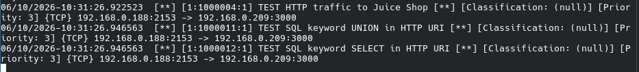

**fig-20 — Спрацювання правила під час brute force**
Багаторазові записи `TEST Juice Shop login attempt` у `fast.log`.
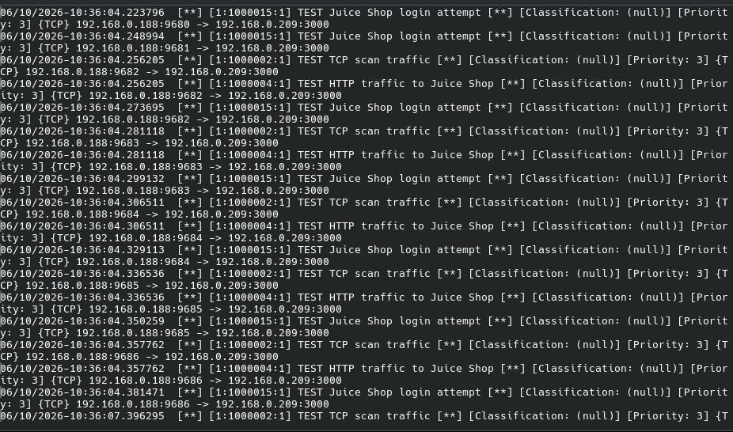

**fig-21 — Ресурси Suricata до навантаження**
`ps` показує ~2.0% CPU, 7.8% RAM, RSS 615512 KB.
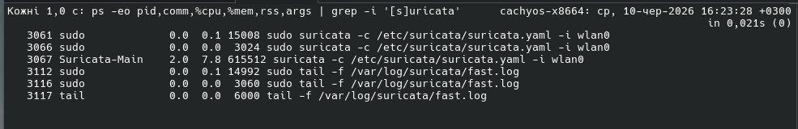

**fig-22 — HTTP-навантаження ApacheBench**
`ab -n 20000 -c 100` — 20 000 запитів, 0 помилок, 221.98 req/sec.
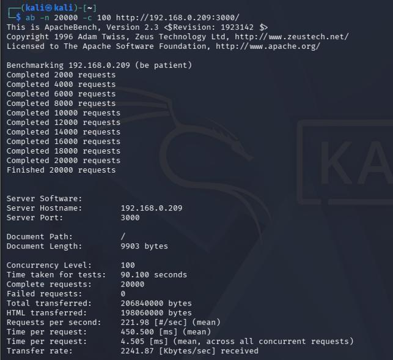

**fig-23 — Ресурси Suricata після навантаження**
`ps` показує ~3.0% CPU, 10.2% RAM, RSS 799416 KB.

